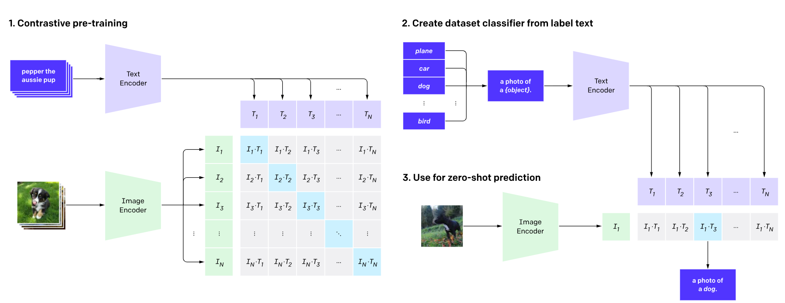

# CLIP-PACL
### Contrastive Language - Image Pre-training (CLIP) and Patch Aligned Contrastive Learning (PACL)

**contents:**

- [Contrastive Language - Image Pre-training](./README.md/#CLIP)
- [Patch Aligned Contrastive Learning](./README.md/#PACL)
- [Architecture](./README.md/#architecture)
- [Core Concepts](./README.md/#TERMS)
- [Assignment](./README.md/#Assignment)
- [DEMO](./README.md/#demo)

<h1 align = 'center',id = "CLIP"> 🤗 Contrastive Language - Image Pre-training (CLIP) </h1>

CLIP or Contrastive Language - Image Pre-training, deviates from the standard practice of fine-tuning a pre-trained model by taking the path of zero-shot learning. Zero-shot learning is the ability of the model to perform tasks that it was not explicitly programmed to do. The core idea of the CLIP paper is essentially to learn visual representation from the massive corpus of natural language data. The paper showed that a simple pre-training task is sufficient to achieve a competitive performance boost in zero-shot learning.

*The objective of the CLIP model can be understood as follows:*

`Given an image, a set of 32,768 sampled text snippets was paired with it in our dataset. For example, given a task to predict a number from an image, the model is likely to predict that “the number is one” or, “the number is two”, or “the number is XYZ” and so on.`

<h1 align = 'center', id = "architecture">  🧠 CLIP Architecture </h1>

**Architecture**

            

